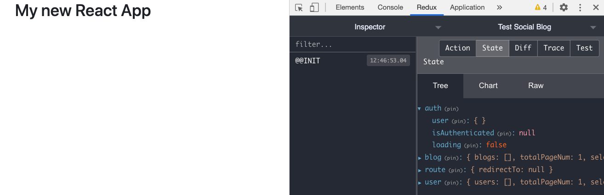

## Redux configuration

### Redux store configuration

- Create `src/redux/store.js`:
  ```javascript
  import { createStore, applyMiddleware } from "redux";
  import { composeWithDevTools } from "redux-devtools-extension";
  import thunk from "redux-thunk";
  import rootReducer from "redux/reducers";

  const initialState = {};
  const store = createStore(
    rootReducer,
    initialState,
    composeWithDevTools(applyMiddleware(thunk))
  );

  export default store;
  ```

- In `src/index.js`:
  ```javascript
  import { Provider } from "react-redux";
  import store from "redux/store";
  ...
  ReactDOM.render(
    <Provider store={store}>
      <App />
    </Provider>
  )
  ```

### The API Service

[axios](https://github.com/axios/axios#request-config) has become undeniably popular among frontend developers. Axios is a promise based HTTP client for the browser and Node.js. Axios makes it easy to send asynchronous HTTP requests to REST endpoints.

We put the axios configuration in `src/redux/api.js`. This config will print out every Request and Response. It also adds `accessToken` to the autorization of the headers, or passes the error message to `react-toastify` automatically.

So all of the connections to the backend API will go through this API service. Think about it like a city gate. 

- Create `src/redux/api.js`

```javascript
import axios from "axios";
import { toast } from "react-toastify";

const api = axios.create({
  baseURL: process.env.REACT_APP_BACKEND_API + "/api",
  headers: {
    "Content-Type": "application/json",
  },
});
/**
 * console.log all requests and responses
 */
api.interceptors.request.use(
  (request) => {
    console.log("Starting Request", request);
    return request;
  },
  function (error) {
    console.log("REQUEST ERROR", error);
  }
);

api.interceptors.response.use(
  (response) => {
    console.log("Response:", response);
    if (response.data.data && response.data.data.accessToken) {
      api.defaults.headers.common["authorization"] = "Bearer " + res.data.data.accessToken;
    }
    return response;
  },
  function (error) {
    error = error.response.data;
    console.log("RESPONSE ERROR", error);
    let errorMsg = error.message || "";
    if (error.errors && error.errors.message)
      errorMsg = errorMsg + ": " + error.errors.message;
    toast.error(errorMsg);
    return Promise.reject(error);
  }
);

export default api;
```

### Prepare the constants, actions and reducers

Now we seperate the global store into 4 main components:

* `auth`: stores data of the login flow, e.g. current user info
* `blog`: stores data about blogs, e.g. list of blogs, selected blog
* `route`: stores the value of `redirectTo` which is a variable to help us redirect react route in redux environment.
* `user`: stores data about user, e.g. friend list, user list

For each component, there are some actions come along. Example:

* `auth`: login, get current user, etc.
* `blog`: get list of blogs, get a single blog, etc.

And the actions require different actions type which we will put in some `constants.js` file in `redux/constants/` folder.

Let's prepare the files first.

**.constants.js**

- In `src/redux/constants/`, create `auth.constants.js`,`blog.constants.js`,`route.constants.js`, and `user.constants.js`. Let them be empty for now.
  ```
  |- constants/
      |- auth.constants.js
      |- blog.constants.js
      |- route.constants.js
      |- user.constants.js
  ```

**.actions.js**
- In `src/redux/actions/`, create `auth.actions.js`, `blog.actions.js`, `route.actions.js`, `user.actions.js`, and `index.js`:
  ```
  |- actions/
      |- auth.actions.js
      |- blog.actions.js
      |- index.js
      |- route.actions.js
      |- user.actions.js
  ```
- In `auth.actions.js`:
  ```javascript
  import * as types from "redux/constants/auth.constants";
  import api from "redux/api";
  import { toast } from "react-toastify";

  export const authActions = {};
  ```
- In `blog.actions.js`:
  ```javascript
  import * as types from "redux/constants/blog.constants";
  import api from "redux/api";
  import { toast } from "react-toastify";

  export const blogActions = {};
  ```
- In `route.actions.js`:
  ```javascript
  import * as types from "redux/constants/route.constants";

  export const routeActions = {};
  ```
- In `user.actions.js`:
  ```javascript
  import * as types from "redux/constants/user.constants";
  import api from "redux/api";
  import { toast } from "react-toastify";

  export const userActions = {};
  ```
- In `redux/actions/index.js`:
  ```javascript
  export * from "./auth.actions";
  export * from "./blog.actions";
  export * from "./route.actions";
  export * from "./user.actions";
  ```

**reducer.js**
- In `src/redux/reducers/`, create `auth.reducer.js`, `blog.reducer.js`, `route.reducer.js`, `user.reducer.js`, and `index.js` (Notice that the filename is `.reducer.js` not `.reducers.js`)
  ```
  |- reducers/
      |- auth.reducer.js
      |- blog.reducer.js
      |- index.js
      |- route.reducer.js
      |- user.reducer.js
  ```
- In `redux/reducers/auth.reducer.js`:
  ```javascript
  import * as types from "redux/constants/auth.constants";
  const initialState = {
    user: {},
    isAuthenticated: null,
    loading: false,
  };

  const authReducer = (state = initialState, action) => {
    const { type, payload } = action;

    switch (type) {
      default:
        return state;
    }
  };

  export default authReducer;
  ```
- In `redux/reducers/blog.reducer.js`:
  ```javascript
  import * as types from "redux/constants/blog.constants";
  const initialState = {
    blogs: [],
    totalPageNum: 1,
    selectedBlog: null,
    loading: false,
  };

  const blogReducer = (state = initialState, action) => {
    const { type, payload } = action;

    switch (type) {
      default:
        return state;
    }
  };

  export default blogReducer;
  ```
- In `redux/reducers/route.reducer.js`:
  ```javascript
  import * as types from "redux/constants/route.constants";
  const initialState = {
    redirectTo: null,
  };

  const routeReducer = (state = initialState, action) => {
    const { type, payload } = action;

    switch (type) {
      default:
        return state;
    }
  };

  export default routeReducer;
  ```
- In `redux/reducers/user.reducer.js`:
  ```javascript
  import * as types from "redux/constants/user.constants";
  const initialState = {
    users: [],
    totalPageNum: 1,
    selectedUser: {},
    loading: false,
  };

  const userReducer = (state = initialState, action) => {
    const { type, payload } = action;

    switch (type) {
      default:
        return state;
    }
  };

  export default userReducer;
  ```
- In `redux/reducer/index.js`:
  ```javascript
  import { combineReducers } from "redux";
  import authReducer from "./auth.reducer";
  import blogReducer from "./blog.reducer";
  import routeReducer from "./route.reducer";
  import userReducer from "./user.reducer";

  export default combineReducers({
    auth: authReducer,
    blog: blogReducer,
    route: routeReducer,
    user: userReducer,
  });
  ```

### Evaluation

- Now let's install [Redux DevTools](https://chrome.google.com/webstore/detail/redux-devtools/lmhkpmbekcpmknklioeibfkpmmfibljd?hl=en). This is an awesome tool for debugging application's state changes.

- Open Chrome DevTools, click on the tab `Redux`, you should see all of the reducers that you have just created:

  

Good job! [Back to instructions](/README.md)