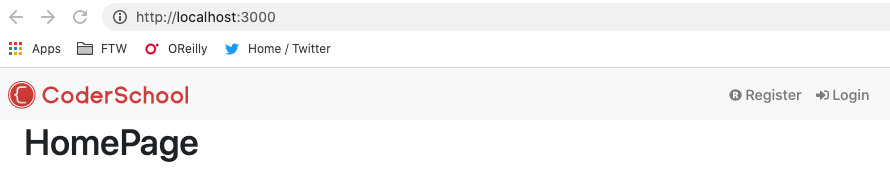
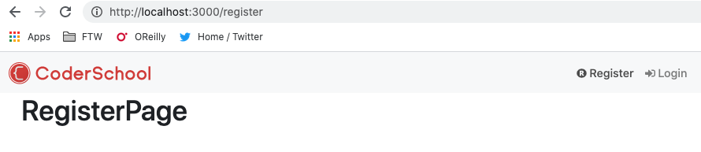
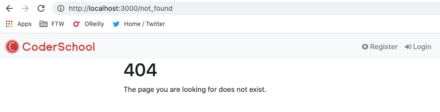
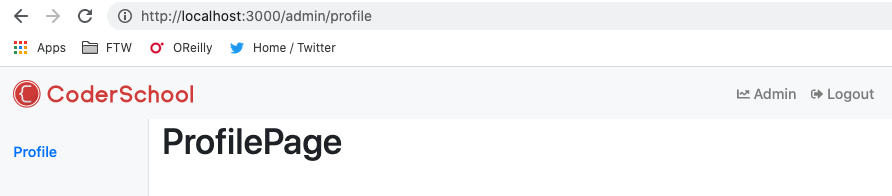

## React Router and layouts

In this step, we'll setup the routes to the pages in our React app, e.g. Home Page, Login Page, Register Page etc. 

There are two different types of layouts called `AdminLayout` and `PublicLayout`. The `AdminLayout` has a side menu in the left side while the `PublicLayout` doesn't have. 

### The Alert Message and Not Found Page

We start with two "stateless" components first:

- Create `src/components/AlertMsg.js`:
  ```javascript
  import React from "react";
  import { ToastContainer } from "react-toastify";
  import "react-toastify/dist/ReactToastify.min.css";

  const AlertMsg = () => {
    return (
      <ToastContainer
        position="top-right"
        hideProgressBar={false}
        newestOnTop={false}
        pauseOnHover
      />
    );
  };

  export default AlertMsg;
  ```

- Create `src/components/NotFoundPage.js`:
  ```javascript
  import React from "react";
  import { Container, Row, Col } from "react-bootstrap";

  const NotFoundPage = () => {
    return (
      <Container>
        <Row>
          <Col md={{ span: 6, offset: 3 }}>
            <h1>404</h1>
            <p>The page you are looking for does not exist.</p>
          </Col>
        </Row>
      </Container>
    );
  };
  export default NotFoundPage;
  ```

### Create pages, navbar, and side menu

- In `src/containers/`, create `AddEditBlogPage.js`, `BlogDetailPage.js`, `HomePage.js`, `LoginPage.js`, `RegisterPage.js`. In each file, use `rface` to create the component and add a `h1` title according to the page. Example, in `src/containers/HomePage.js`:

  ```javascript
  import React from "react";

  const HomePage = () => {
    return (
      <div>
        <h1>HomePage</h1>
      </div>
    );
  };

  export default HomePage;
  ```

- Put the logo of your app (the one at the top left corner) in `src/images/logo.svg` (it doesn't need to be a SVG file, PNG is ok). Create new file `src/containers/PublicNavbar.js`:
  ```javascript
  import React from "react";
  import { Navbar, Nav } from "react-bootstrap";
  import { Link } from "react-router-dom";
  import logo from "images/logo.svg";
  import { useSelector } from "react-redux";
  import { FontAwesomeIcon } from "@fortawesome/react-fontawesome";

  const PublicNavbar = () => {
    const isAuthenticated = useSelector((state) => state.auth.isAuthenticated);
    const loading = useSelector((state) => state.auth.loading);

    const handleLogout = () => {};

    const authLinks = (
      <Nav>
        <Nav.Link as={Link} to="/admin/profile">
          <FontAwesomeIcon icon="chart-line" size="sm" /> Admin
        </Nav.Link>
        <Nav.Link onClick={handleLogout}>
          <FontAwesomeIcon icon="sign-out-alt" size="sm" /> Logout
        </Nav.Link>
      </Nav>
    );

    const publicLinks = (
      <Nav>
        <Nav.Link as={Link} to="/register">
          <FontAwesomeIcon icon="registered" size="sm" /> Register
        </Nav.Link>
        <Nav.Link as={Link} to="/login">
          <FontAwesomeIcon icon="sign-in-alt" size="sm" /> Login
        </Nav.Link>
      </Nav>
    );

    return (
      <Navbar bg="light" expand="lg">
        <Navbar.Brand as={Link} to="/" className="mr-auto">
          
        </Navbar.Brand>
        <Navbar.Toggle aria-controls="basic-navbar-nav" />
        <Navbar.Collapse id="basic-navbar-nav">
          <Nav className="mr-auto"></Nav>
          {!loading && <>{isAuthenticated ? authLinks : publicLinks}</>}
        </Navbar.Collapse>
      </Navbar>
    );
  };

  export default PublicNavbar;
  ```

- Create a new folder called `Admin\` in `src\containers\`. In the `Admin\` folder, create `ProfilePage.js`, `BlogListPage.js`, `FriendListPage.js`, and `MessengerPage.js`. In each file, use `rface` to create the component and add a `h1` title according to the page. Example:

  - `src\containers\Admin\ProfilePage.js`
  ```javascript
  import React from "react";

  const ProfilePage = () => {
    return (
      <div>
        <h1>ProfilePage</h1>
      </div>
    );
  };

  export default ProfilePage;
  ```

  - Create `src\containers\Admin\SideMenu.js`
  ```javascript
  import React from "react";
  import { Nav } from "react-bootstrap";
  import { NavLink } from "react-router-dom";

  const SideMenu = () => {
    return (
      <Nav className="col-md-3 col-lg-2 d-md-block bg-light sidebar collapse">
        <div className="sidebar-sticky pt-3">
          <Nav.Item>
            <Nav.Link
              as={NavLink}
              to="/admin/profile"
              activeClassName="active"
              strict={true}
            >
              Profile
            </Nav.Link>
          </Nav.Item>
          <Nav.Item>
            <Nav.Link
              as={NavLink}
              to="/admin/blogs"
              activeClassName="active"
              strict={true}
            >
              Blogs
            </Nav.Link>
          </Nav.Item>
          <Nav.Item>
            <Nav.Link
              as={NavLink}
              to="/admin/friends"
              activeClassName="active"
              strict={true}
            >
              Friends
            </Nav.Link>
          </Nav.Item>
          <Nav.Item>
            <Nav.Link
              as={NavLink}
              to="/admin/messenger"
              activeClassName="active"
              strict={true}
            >
              Messenger
            </Nav.Link>
          </Nav.Item>
        </div>
      </Nav>
    );
  };

  export default SideMenu;
  ```
  Add some CSS in `src/App.css`:
  ```css
  /*
  * Sidebar
  */

  .sidebar {
    top: 0;
    bottom: 0;
    left: 0;
    z-index: 100; /* Behind the navbar */
    min-height: 100vh !important;
    padding: 0;
    box-shadow: inset -1px 0 0 rgba(0, 0, 0, .1);
  }

  @media (max-width: 767.98px) {
    .sidebar {
      top: 5rem;
    }
  }

  .sidebar-sticky {
    top: 0;
    height: calc(100vh - 48px);
    padding-top: .5rem;
    overflow-x: hidden;
    overflow-y: auto; /* Scrollable contents if viewport is shorter than content. */
  }

  @supports ((position: -webkit-sticky) or (position: sticky)) {
    .sidebar-sticky {
      position: -webkit-sticky;
      position: sticky;
    }
  }

  .nav-link {
    font-weight: 500;
    color: #333;
  }

  .nav-link.active {
    color: #007bff !important;
  }
  ```

### Define routes and layouts

Now we have all of the pieces we need for the structure of our project. Let's put them together:

- Create a folder called `Routes` in `src/containers/`. In the `Routes` folder, create `src/containers/Routes/PrivateRoute.js`:
  ```javascript
  import React from "react";
  import { Route, Redirect } from "react-router-dom";
  import { useSelector } from "react-redux";

  const PrivateRoute = ({ ...rest }) => {
    const isAuthenticated = useSelector((state) => state.auth.isAuthenticated);
    if (isAuthenticated) return <Route {...rest} />;
    delete rest.component;
    return <Route {...rest} render={(props) => <Redirect to="/login" />} />;
  };

  export default PrivateRoute;
  ```
  This is the component for routes that require user authentication.

- Create a folder called `layouts` in  `src/containers/Routes/`.

- In `src/containers/Routes/layouts/`, create `PublicLayout.js`:
  ```javascript
  import React from "react";
  import { Container } from "react-bootstrap";
  import { Switch, Route } from "react-router-dom";
  import AlertMsg from "components/AlertMsg";
  import NotFoundPage from "components/NotFoundPage";
  import AddEditBlogPage from "containers/AddEditBlogPage";
  import BlogDetailPage from "containers/BlogDetailPage";
  import HomePage from "containers/HomePage";
  import LoginPage from "containers/LoginPage";
  import PublicNavbar from "containers/PublicNavbar";
  import RegisterPage from "containers/RegisterPage";
  import PrivateRoute from "containers/Routes/PrivateRoute";

  const PublicLayout = () => {
    return (
      <>
        <PublicNavbar />
        <Container>
          <AlertMsg />
          <Switch>
            <Route exact path="/" component={HomePage} />
            <Route exact path="/login" component={LoginPage} />
            <Route exact path="/register" component={RegisterPage} />
            <Route exact path="/blogs/:id" component={BlogDetailPage} />
            <PrivateRoute exact path="/blog/add" component={AddEditBlogPage} />
            <PrivateRoute
              exact
              path="/blog/edit/:id"
              component={AddEditBlogPage}
            />
            <Route component={NotFoundPage} />
          </Switch>
        </Container>
      </>
    );
  };

  export default PublicLayout;
  ```

- In `src/containers/Routes/layouts/`, create `AdminLayout.js`:
  ```javascript
  import React from "react";
  import { Container, Row, Col } from "react-bootstrap";
  import { Switch, Route } from "react-router-dom";
  import NotFoundPage from "components/NotFoundPage";
  import AddEditBlogPage from "containers/AddEditBlogPage";
  import ProfilePage from "containers/Admin/ProfilePage";
  import SideMenu from "containers/Admin/SideMenu";
  import BlogDetailPage from "containers/BlogDetailPage";
  import BlogListPage from "containers/Admin/BlogListPage";
  import FriendListPage from "containers/Admin/FriendListPage";
  import MessengerPage from "containers/Admin/MessengerPage";
  import PublicNavbar from "containers/PublicNavbar";
  import AlertMsg from "components/AlertMsg";

  const AdminLayout = () => {
    return (
      <>
        <PublicNavbar />
        <Container fluid>
          <Row>
            <SideMenu />
            <Col md={9} lg={10}>
              <AlertMsg />
              <Switch>
                <Route exact path="/admin/profile" component={ProfilePage} />
                <Route exact path="/admin/blogs" component={BlogListPage} />
                <Route exact path="/admin/blogs/:id" component={BlogDetailPage} />
                <Route exact path="/admin/blog/add" component={AddEditBlogPage} />
                <Route
                  exact
                  path="/admin/blog/edit/:id"
                  component={AddEditBlogPage}
                />
                <Route exact path="/admin/friends" component={FriendListPage} />
                <Route exact path="/admin/messenger" component={MessengerPage} />
                <Route component={NotFoundPage} />
              </Switch>
            </Col>
          </Row>
        </Container>
      </>
    );
  };

  export default AdminLayout;
  ```

- Finally, create `index.js` in `src/containers/Routes/`:
  ```javascript
  import React from "react";
  import { Route, Switch } from "react-router-dom";
  import AdminLayout from "containers/Routes/layouts/AdminLayout";
  import PublicLayout from "containers/Routes/layouts/PublicLayout";
  import PrivateRoute from "containers/Routes/PrivateRoute";

  const Routes = (props) => {
    return (
      <Switch>
        <PrivateRoute path="/admin" component={AdminLayout} />
        <Route path="/" component={PublicLayout} />
      </Switch>
    );
  };
  export default Routes;
  ```

  And integrate the routes into `src/App.js`:
  ```javascript
  import React from "react";
  import "App.css";
  import "bootstrap/dist/css/bootstrap.min.css";
  import { BrowserRouter as Router } from "react-router-dom";
  import Routes from "containers/Routes";

  // Adding Fontawesome icons
  import { library } from "@fortawesome/fontawesome-svg-core";
  import { faAngry, faLaugh, faSadCry, faThumbsUp, faHeart, faPlus, faTrashAlt, faEdit, faChevronLeft, faSort, faCheckSquare, faTimesCircle, faPauseCircle, faCircle, faUser, faRegistered, faChartLine, faSignOutAlt, faSignInAlt } from "@fortawesome/free-solid-svg-icons";
  import { fab } from "@fortawesome/free-brands-svg-icons";

  library.add( fab, faAngry, faLaugh, faSadCry, faThumbsUp, faHeart, faPlus, faTrashAlt, faEdit, faChevronLeft, faSort, faCheckSquare, faTimesCircle, faPauseCircle, faCircle, faUser, faRegistered, faChartLine, faSignOutAlt, faSignInAlt );

  function App() {
    return (
      <Router>
        <Routes />
      </Router>
    );
  }

  export default App;
  ```

### Evaluation

- Open your browser `localhost:3000`:
  

- Click on `Register` and `Login` should lead you to the register page and login page:
  
  

- Try to go to `localhost:3000/not_found`:
  

- Try to go to `localhost:3000/admin/profile`, you should be redirect to the Login page, because the `/admin` route is protected.

- Go to `src/redux/reducers/auth.reducer.js`, change `isAuthenticated` in `initialState` from `null` to `true`. Try to go to `localhost:3000/admin/profile` again, now it should work:
  

- Also test the other routes:
  * `/blog/add`
  * `admin/blog/add`
  * `/blogs/just_a_blog_id`
  * `admin/blogs/just_a_blog_id`

- You can see the routes that start with `/admin` have different layout with a side menu in the left side.

- You can see the navbar changes if you change the value of `isAuthenticated` in `auth.reducer.js`. Remember to turn it back to `null`.

Good job! [Back to instructions](/README.md)