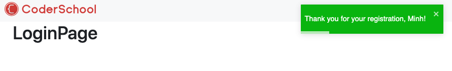

## Registration

User can register a new account.

### Action and reducer

- In `src/redux/constants/auth.constants.js`:
  ```javascript
  export const REGISTER_REQUEST = "AUTH.REGISTER_REQUEST";
  export const REGISTER_SUCCESS = "AUTH.REGISTER_SUCCESS";
  export const REGISTER_FAILURE = "AUTH.REGISTER_FAILURE";
  ```
- In `src/redux/actions/auth.actions.js`:
  ```javascript
  import { routeActions } from "redux/actions/route.actions";

  const register = (name, email, password, avatarUrl) => async (dispatch) => {
    dispatch({ type: types.REGISTER_REQUEST, payload: null });
    try {
      const res = await api.post("/users", { name, email, password, avatarUrl });
      dispatch({ type: types.REGISTER_SUCCESS, payload: res.data.data });
      dispatch(routeActions.redirect("/login"));
      toast.success(`Thank you for your registration, ${name}!`);
    } catch (error) {
      dispatch({ type: types.REGISTER_FAILURE, payload: error });
    }
  };

  export const authActions = {
    register,
  };
  ```
- In `src/redux/reducers/auth.reducer.js`:
  ```javascript
  const authReducer = (state = initialState, action) => {
    const { type, payload } = action;

    switch (type) {
      case types.REGISTER_REQUEST:
        return { ...state, loading: true };
      case types.REGISTER_SUCCESS:
        return {...state, loading: false };
      case types.REGISTER_FAILURE:
        return { ...state, loading: false };

      default:
        return state;
    }
  };
  ```

### The GUI (Graphical User Interface)

In the registration form, we have four fields: name, email, avatarUrl, and password. We controll the input box component by using the `useState()` hook:

```javascript
const [formData, setFormData] = useState({
  name: "",
  email: "",
  password: "",
  password2: "",
  avatarUrl: ""
});
```

You can put some values here for saving some keystrokes by testing.

There is a function called `handleChange()` to update `formData` whenever user type in something:

```javascript
const handleChange = (e) =>
  setFormData({ ...formData, [e.target.name]: e.target.value });
```

`handleChange()` requires the input box (we are using `<Form.Control>` of `react-bootstrap`) to have the attribute `name` that define the connected field in `formData`, example:

```javascript
<Form.Control
  type="text"
  placeholder="Avatar"
  name="avatarUrl"
  value={formData.avatarUrl}
  onChange={handleChange}
/>
```

Finally, after putting everything together in `RegisterPage.js`, it looks like this:

```javascript
import React, { useState, useEffect } from "react";
import { Link, useHistory } from "react-router-dom";
import { Form, Button, Container, Row, Col } from "react-bootstrap";
import { useSelector, useDispatch } from "react-redux";
import { FontAwesomeIcon } from "@fortawesome/react-fontawesome";
import { authActions, routeActions } from "redux/actions";

const RegisterPage = () => {
  const [formData, setFormData] = useState({
    name: "Minh",
    email: "minhdo@gmail.com",
    password: "123",
    password2: "123",
    avatarUrl:
      "https://lh3.googleusercontent.com/a-/AOh14GhnQ6aJ2YnaevyJzhii-qGws6Y17w-cwWLqF5iP",
  });
  const [errors, setErrors] = useState({
    name: "",
    email: "",
    password: "",
    password2: "",
  });

  const dispatch = useDispatch();
  const loading = useSelector((state) => state.auth.loading);
  const redirectTo = useSelector((state) => state.route.redirectTo);
  const history = useHistory();

  const handleChange = (e) =>
    setFormData({ ...formData, [e.target.name]: e.target.value });

  const handleSubmit = (e) => {
    e.preventDefault();
    const { name, email, password, password2, avatarUrl } = formData;
    if (password !== password2) {
      setErrors({ ...errors, password2: "Passwords do not match" });
      return;
    }
    dispatch(authActions.register(name, email, password, avatarUrl));
  };

  useEffect(() => {
    if (redirectTo) {
      if (redirectTo === "__GO_BACK__") {
        history.goBack();
        dispatch(routeActions.removeRedirectTo());
      } else {
        history.push(redirectTo);
        dispatch(routeActions.removeRedirectTo());
      }
    }
  }, [dispatch, history, redirectTo]);

  return (
    <Container>
      <Row>
        <Col md={{ span: 6, offset: 3 }}>
          <div className="text-center mb-3">
            <h1 className="text-primary">Sign Up</h1>
            <p className="lead">
              <FontAwesomeIcon icon="user" size="1x" /> Create Your Account
            </p>
          </div>
          <Form onSubmit={handleSubmit}>
            <Form.Group>
              <Form.Control
                type="text"
                placeholder="Avatar"
                name="avatarUrl"
                value={formData.avatarUrl}
                onChange={handleChange}
              />
            </Form.Group>
            <Form.Group>
              <Form.Control
                type="text"
                placeholder="Name"
                name="name"
                value={formData.name}
                onChange={handleChange}
              />
              {errors.name && (
                <small className="form-text text-danger">{errors.name}</small>
              )}
            </Form.Group>
            <Form.Group>
              <Form.Control
                type="email"
                placeholder="Email Address"
                name="email"
                value={formData.email}
                onChange={handleChange}
              />
              {errors.email && (
                <small className="form-text text-danger">{errors.email}</small>
              )}
            </Form.Group>
            <Form.Group>
              <Form.Control
                type="password"
                placeholder="Password"
                name="password"
                value={formData.password}
                onChange={handleChange}
              />
              {errors.password && (
                <small className="form-text text-danger">
                  {errors.password}
                </small>
              )}
            </Form.Group>
            <Form.Group>
              <Form.Control
                type="password"
                placeholder="Confirm Password"
                name="password2"
                value={formData.password2}
                onChange={handleChange}
              />
            </Form.Group>

            {loading ? (
              <Button
                className="btn-block"
                variant="primary"
                type="button"
                disabled
              >
                <span
                  className="spinner-border spinner-border-sm"
                  role="status"
                  aria-hidden="true"
                ></span>
                Loading...
              </Button>
            ) : (
              <Button className="btn-block" type="submit" variant="primary">
                Register
              </Button>
            )}

            <p>
              Already have an account? <Link to="/login">Sign In</Link>
            </p>
          </Form>
        </Col>
      </Row>
    </Container>
  );
};

export default RegisterPage;
```

### Evaluation

- After successfully create an account, you should be redirect to the login page. A success message will pop up in the top left of the window.



Good job! [Back to instructions](/README.md)