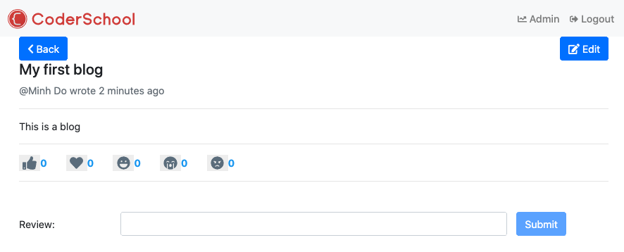
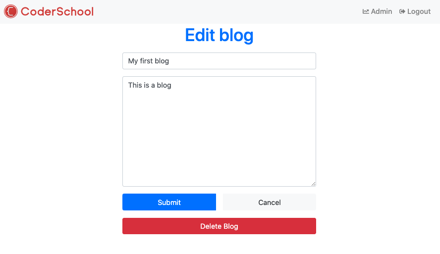

## Create, edit, delete blogs

In this step, we will implement Create, Edit, and Delete Blog features for authenticated user.

### Action and reducer

- In `src/redux/constants/blog.constants.js`, add:
  ```javascript
  //...
  export const CREATE_BLOG_REQUEST = "BLOG.CREATE_BLOG_REQUEST";
  export const CREATE_BLOG_SUCCESS = "BLOG.CREATE_BLOG_SUCCESS";
  export const CREATE_BLOG_FAILURE = "BLOG.CREATE_BLOG_FAILURE";

  export const UPDATE_BLOG_REQUEST = "BLOG.UPDATE_BLOG_REQUEST";
  export const UPDATE_BLOG_SUCCESS = "BLOG.UPDATE_BLOG_SUCCESS";
  export const UPDATE_BLOG_FAILURE = "BLOG.UPDATE_BLOG_FAILURE";

  export const DELETE_BLOG_REQUEST = "BLOG.DELETE_BLOG_REQUEST";
  export const DELETE_BLOG_SUCCESS = "BLOG.DELETE_BLOG_SUCCESS";
  export const DELETE_BLOG_FAILURE = "BLOG.DELETE_BLOG_FAILURE";
  ```
- In `src/redux/actions/blog.actions.js`, add:
  ```javascript
  //...
  const createNewBlog = (title, content, images, redirectTo="__GO_BACK__") => async (dispatch) => {
    dispatch({ type: types.CREATE_BLOG_REQUEST, payload: null });
    try {
      const res = await api.post("/blogs", { title, content, images });
      dispatch({
        type: types.CREATE_BLOG_SUCCESS,
        payload: res.data.data,
      });
      dispatch(routeActions.redirect(redirectTo));
      toast.success("New blog has been created!");
    } catch (error) {
      console.log(error);
      dispatch({ type: types.CREATE_BLOG_FAILURE, payload: error });
    }
  };

  const updateBlog = (blogId, title, content, images, redirectTo="__GO_BACK__") => async (dispatch) => {
    dispatch({ type: types.UPDATE_BLOG_REQUEST, payload: null });
    try {
      const res = await api.put(`/blogs/${blogId}`, { title, content, images });
      dispatch({
        type: types.UPDATE_BLOG_SUCCESS,
        payload: res.data.data,
      });
      dispatch(routeActions.redirect(redirectTo));
      toast.success("The blog has been updated!");
    } catch (error) {
      console.log(error);
      dispatch({ type: types.UPDATE_BLOG_FAILURE, payload: error });
    }
  };

  const deleteBlog = (blogId, redirectTo="__GO_BACK__") => async (dispatch) => {
    dispatch({ type: types.DELETE_BLOG_REQUEST, payload: null });
    try {
      const res = await api.delete(`/blogs/${blogId}`);
      dispatch({
        type: types.DELETE_BLOG_SUCCESS,
        payload: res.data,
      });
      dispatch(routeActions.redirect(redirectTo));
      toast.success("The blog has been deleted!");
    } catch (error) {
      console.log(error);
      dispatch({ type: types.DELETE_BLOG_FAILURE, payload: error });
    }
  };

  export const blogActions = {
    blogsRequest,
    getSingleBlog,
    createReview,
    sendEmojiReaction,
    createNewBlog,
    updateBlog,
    deleteBlog,
  };
  ```
- In `src/redux/reducers/blog.reducer.js`, add:
  ```javascript
  const blogReducer = (state = initialState, action) => {
    const { type, payload } = action;

    switch (type) {
      //...
      case types.CREATE_BLOG_REQUEST:
      case types.UPDATE_BLOG_REQUEST:
      case types.DELETE_BLOG_REQUEST:
        return { ...state, loading: true };

      case types.CREATE_BLOG_SUCCESS:
        return { ...state, loading: false };
      case types.UPDATE_BLOG_SUCCESS:
        return {
          ...state,
          selectedBlog: payload,
          loading: false,
        };
      case types.DELETE_BLOG_SUCCESS:
        return {
          ...state,
          loading: false,
          selectedBlog: {},
        };

      case types.CREATE_BLOG_FAILURE:
      case types.UPDATE_BLOG_FAILURE:
      case types.DELETE_BLOG_FAILURE:
        return { ...state, loading: false };

      default:
        return state;
    }
  };

  export default blogReducer;
  ```

### Integrate with the UI 

We are going to use only one page for create, edit and also delete, which is `AddEditBlogPage.js`. We won't handle upload images for now, just focus on the CRUD process of blogs.

- In `src/containers/AddEditBlogPage.js`:
  ```javascript
  import React, { useState, useEffect } from "react";
  import { useDispatch, useSelector } from "react-redux";
  import {
    Form,
    Button,
    Container,
    Row,
    Col,
    ButtonGroup,
  } from "react-bootstrap";
  import { useHistory, useParams } from "react-router-dom";
  import { blogActions, routeActions } from "redux/actions";

  const AddEditBlogPage = () => {
    const [formData, setFormData] = useState({
      title: "",
      content: "",
      images: ["http://placeimg.com/400/300", "http://placeimg.com/400/300"],
    });
    const loading = useSelector((state) => state.blog.loading);
    const dispatch = useDispatch();
    const history = useHistory();
    const params = useParams();
    const selectedBlog = useSelector((state) => state.blog.selectedBlog);
    const redirectTo = useSelector((state) => state.route.redirectTo);
    const addOrEdit = params.id ? "Edit" : "Add";
    const blogId = params.id;

    useEffect(() => {
      if (blogId) {
        if (!selectedBlog) {
          dispatch(blogActions.getSingleBlog(blogId));
        }
        setFormData((formData) => ({
          ...formData,
          title: selectedBlog.title,
          content: selectedBlog.content,
          images: selectedBlog.images,
        }));
      }
    }, [blogId, selectedBlog, dispatch]);

    const handleChange = (e) => {
      setFormData({ ...formData, [e.target.name]: e.target.value });
    };

    const handleSubmit = (e) => {
      e.preventDefault();
      const { title, content, images } = formData;
      if (addOrEdit === "Add") {
        dispatch(blogActions.createNewBlog(title, content, images));
      } else if (addOrEdit === "Edit") {
        dispatch(
          blogActions.updateBlog(selectedBlog._id, title, content, images)
        );
      }
    };

    const handleCancel = () => {
      history.goBack();
    };

    const handleDelete = () => {
      dispatch(blogActions.deleteBlog(selectedBlog._id, '/'));
    };

    useEffect(() => {
      if (redirectTo) {
        if (redirectTo === "__GO_BACK__") {
          history.goBack();
          dispatch(routeActions.removeRedirectTo());
        } else {
          history.push(redirectTo);
          dispatch(routeActions.removeRedirectTo());
        }
      }
    }, [redirectTo, dispatch, history]);

    return (
      <Container>
        <Row>
          <Col md={{ span: 6, offset: 3 }}>
            <Form onSubmit={handleSubmit}>
              <div className="text-center mb-3">
                <h1 className="text-primary">{addOrEdit} blog</h1>
                <p className="lead">
                  <i className="fas fa-user" />
                </p>
              </div>
              <Form.Group>
                <Form.Control
                  type="text"
                  required
                  placeholder="Title"
                  name="title"
                  value={formData.title}
                  onChange={handleChange}
                />
              </Form.Group>
              <Form.Group>
                <Form.Control
                  as="textarea"
                  rows="10"
                  placeholder="Content"
                  name="content"
                  value={formData.content}
                  onChange={handleChange}
                />
              </Form.Group>

              <ButtonGroup className="d-flex mb-3">
                {loading ? (
                  <Button
                    className="mr-3"
                    variant="primary"
                    type="button"
                    disabled
                  >
                    <span
                      className="spinner-border spinner-border-sm"
                      role="status"
                      aria-hidden="true"
                    ></span>
                    Submitting...
                  </Button>
                ) : (
                  <Button className="mr-3" type="submit" variant="primary">
                    Submit
                  </Button>
                )}
                <Button variant="light" onClick={handleCancel} disabled={loading}>
                  Cancel
                </Button>
              </ButtonGroup>
              {addOrEdit === "Edit" && (
                <ButtonGroup className="d-flex">
                  <Button
                    variant="danger"
                    onClick={handleDelete}
                    disabled={loading}
                  >
                    Delete Blog
                  </Button>
                </ButtonGroup>
              )}
            </Form>
          </Col>
        </Row>
      </Container>
    );
  };

  export default AddEditBlogPage;
  ```

- In `HomePage/index.js`, let create a button for user to start writing:
  ```javascript
  const isAuthenticated = useSelector((state) => state.auth.isAuthenticated);
  ...
  <h1>Social Blog</h1>
  <p>Write about your amazing experiences.</p>
  {isAuthenticated && (
    <Link to="/blog/add">
      <Button variant="primary">Write now</Button>
    </Link>
  )}
  ```

### Evaluation

- On the home page, click on the button "Write now" should lead you to the Add Blog page. Fill in the title and content:
  

- Submit the blog, you should be redirected **back** (to the home page).
  

- You should see the blog that you have just created. Open the blog, you should see a button `Edit` in the top right corner, because you are the owner of the blog.
  

- Click the `Edit` button, you should be redirected to Edit Blog page where you can change the title or content of the blog. Submit your change then the app should lead you **back** (to the blog detail page). If you delete the blog, you should find yourself in the home page afterwards.
  

Good job! [Back to instructions](/README.md)