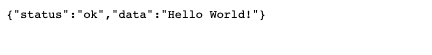

## Setup with express-generator

- Create new project
  ```bash
  $ mkdir your_project_name
  $ cd your_project_name
  $ npx express-generator --no-view
  $ npm install
  $ git init
  ```

- Install `nodemon` to keep tracking your changes and automatically restart server:
  ```bash
  npm install --save-dev nodemon
  ```
  Open `package.json`, add `"dev": "nodemon ./bin/www"` to `"scripts: {..}"`

- Install dependencies:
  ```bash
  npm i dotenv cors
  npm i mongoose mkdirp
  npm i jsonwebtoken bcryptjs express-validator
  npm i faker
  ```

- Remove everything in `public/`

- Create `\.env`:
  ```
  PORT=5000
  ```
  Also add to `app.js`:
  ```javascript
  const express = require("express");
  require("dotenv").config();
  //...
  ```

- Create `\.gitignore`:
  ```
  node_modules/
  .DS_Store
  .vscode/
  *lock.json
  build
  .env
  config/
  ```

- In `/routes/index.js`, replace `res.render('index', { title: 'Express' });` with
  ```javascript
  res.send({status:'ok', data:"Hello World!"});
  ```

### Evaluation

- Test the app: `npm run dev`, then open `localhost:5000` on the browser. You should see `{"status":"ok","data":"Hello World!"}` on the screen.



Good job! [Back to instructions](/README.md)