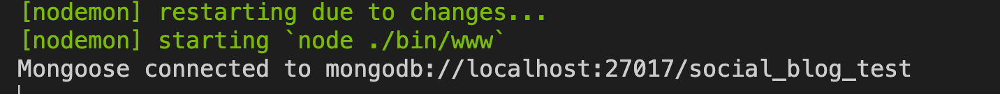
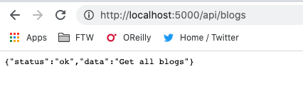
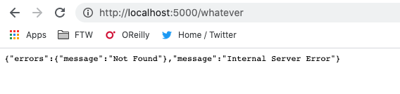

## Setup app.js

- Create `/helpers/utils.helper.js`:
  ```javascript
  "use strict";
  const utilsHelper = {};

  // This function controls the way we response to the client
  // If we need to change the way to response later on, we only need to handle it here
  utilsHelper.sendResponse = (res, status, success, data, errors, message) => {
    const response = {};
    if (success) response.success = success;
    if (data) response.data = data;
    if (errors) response.errors = errors;
    if (message) response.message = message;
    return res.status(status).json(response);
  };

  utilsHelper.generateRandomHexString = (len) => {
    return crypto
      .randomBytes(Math.ceil(len / 2))
      .toString("hex") // convert to hexadecimal format
      .slice(0, len)
      .toUpperCase(); // return required number of characters
  };

  // Error handling
  utilsHelper.catchAsync = (func) => (req, res, next) =>
    func(req, res, next).catch((err) => next(err));

  class AppError extends Error {
    constructor(statusCode, message, errorType) {
      super(message);
      this.statusCode = statusCode;
      this.errorType = errorType;
      // all errors using this class are operational errors.
      this.isOperational = true;
      // create a stack trace for debugging (Error obj, void obj to avoid stack polution)
      Error.captureStackTrace(this, this.constructor);
    }
  }

  utilsHelper.AppError = AppError;
  module.exports = utilsHelper;
  ```

- In `app.js`, add: 
  ```diff 
  +const utilsHelper = require("./helpers/utils.helper");

  const app = express();
  ```

- In `routes/`, delete `users.js`. In `app.js`,remove
  ```diff
  -const usersRouter = require("./routes/users");
  ...
  -app.use("/users", usersRouter);
  ```

- Create `routes/blog.api.js`:
  ```javascript
  const express = require("express");
  const router = express.Router();

  /**
   * @route GET api/blogs?page=1&limit=10
   * @description Get blogs with pagination
   * @access Public
   */
  router.get("/", function (req, res, next) {
    res.send({ status: "ok", data: "Get all blogs" });
  });

  module.exports = router;
  ```

- In `routes/index.js`, replace everything with:
  ```javascript
  const express = require("express");
  const router = express.Router();

  // blogAPI
  const blogAPI = require("./blog.api");
  router.use("/blogs", blogAPI);

  module.exports = router;
  ```

  In `app.js`, change:
  ```diff
  -app.use("/", indexRouter);
  +app.use("/api", indexRouter);
  ```

- Import `cors`:
  ```diff
  const logger = require("morgan");
  +const cors = require("cors")
  ...
  app.use(cookieParser());
  +app.use(cors());
  ```

- Connect to DB
  - In `.env`, add
  ```
  MONGODB_URI='mongodb://localhost:27017/social_blog'
  ```
  - In `app.js`:
  ```javascript
  const mongoose = require('mongoose')
  const mongoURI = process.env.MONGODB_URI
  ...
  app.use(express.static(path.join(__dirname, "public")));

  /* DB Connections */
  mongoose
    .connect(mongoURI, {
      // some options to deal with deprecated warning
      useCreateIndex: true,
      useNewUrlParser: true,
      useFindAndModify: false,
      useUnifiedTopology: true,
    })
    .then(() => console.log(`Mongoose connected to ${mongoURI}`))
    .catch((err) => console.log(err));
  ```

- Error Handling: In `app.js`, add
  ```javascript
  /* Initialize Routes */
  app.use("/api", indexRouter);

  // catch 404 and forard to error handler
  app.use((req, res, next) => {
    const err = new Error("Not Found");
    err.statusCode = 404;
    next(err);
  });

  /* Initialize Error Handling */
  app.use((err, req, res, next) => {
    console.log("ERROR", err);
    if (err.isOperational) {
      return utilsHelper.sendResponse(
        res,
        err.statusCode ? err.statusCode : 500,
        false,
        null,
        { message: err.message },
        err.errorType
      );
    } else {
      return utilsHelper.sendResponse(
        res,
        err.statusCode ? err.statusCode : 500,
        false,
        null,
        { message: err.message },
        "Internal Server Error"
      );
    }
  });
  
  module.exports = app;
  ```

### Evaluation

- Run `npm run dev` in the terminal
  
- Open your browser and test `http://localhost:5000/api/blogs`:
  
- And test `localhost:5000\whatever`:
  

Good job! [Back to instructions](/README.md)