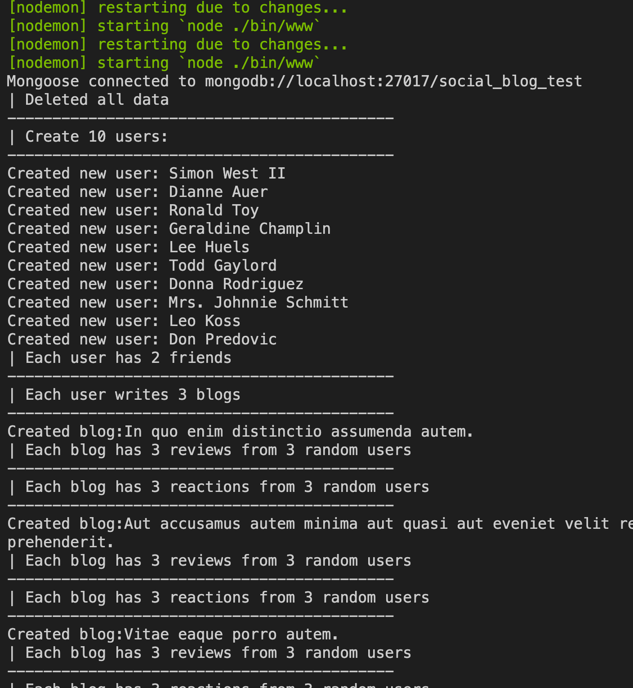
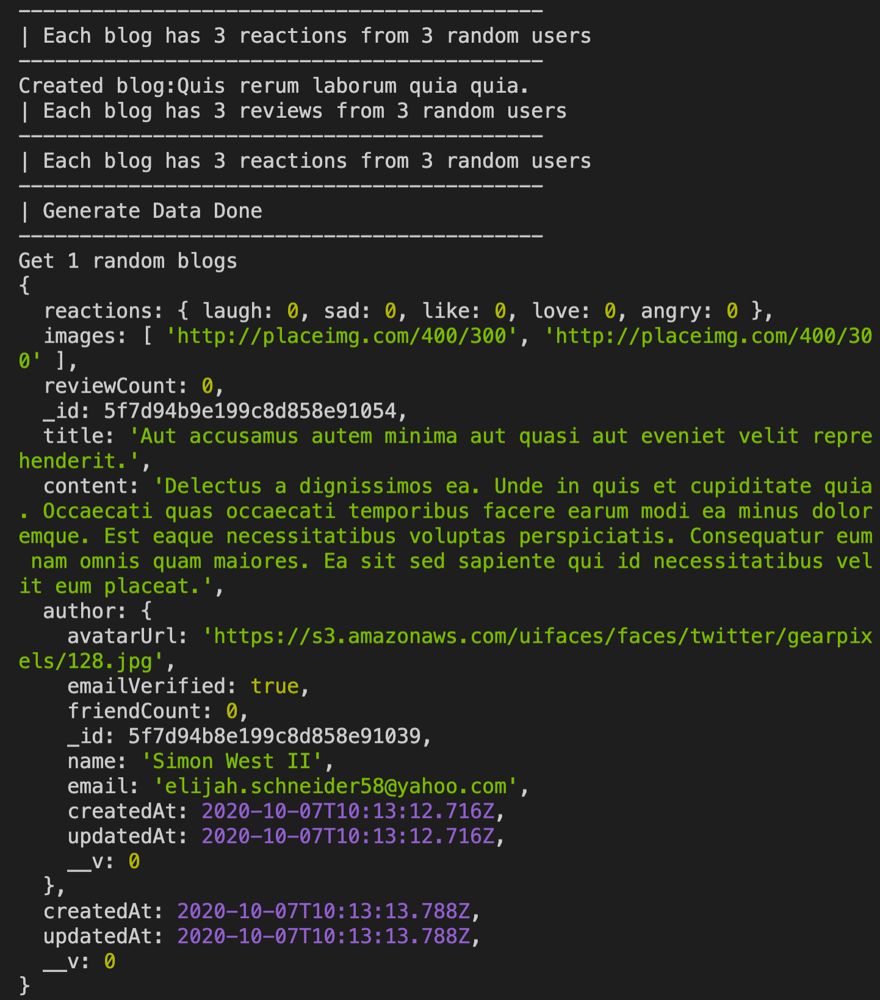
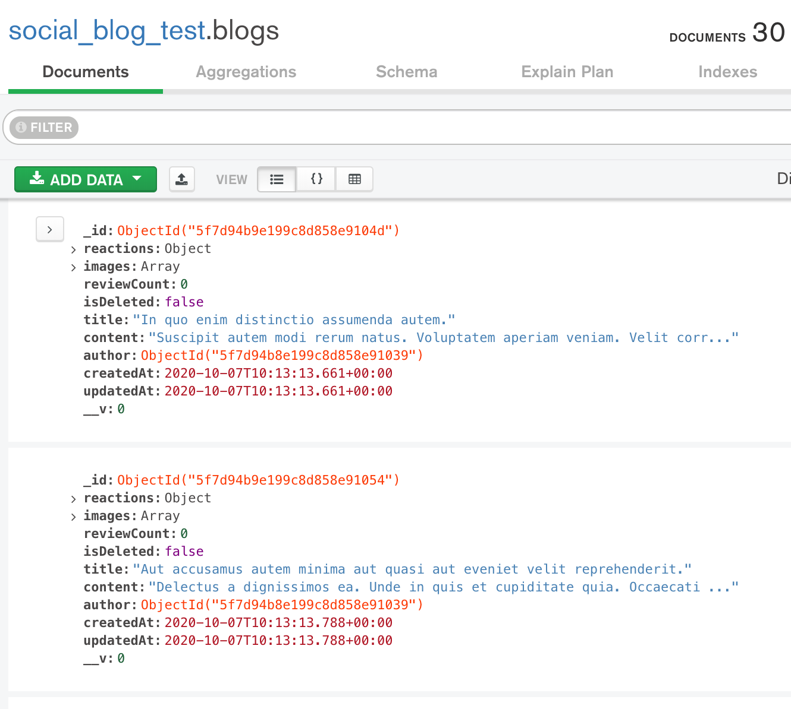

## Design database schema

In this step, we work on Mongoose schemas and middlewares. It's worth to think about it seriously because the database is the core of your platform.

Let's start with basic schemas first:

- Create `/models/Blog.js`:
  ```javascript
  const mongoose = require("mongoose");
  const Schema = mongoose.Schema;

  const blogSchema = Schema(
    {
      title: { type: String, required: true },
      content: { type: String, required: true },
      author: {
        type: Schema.Types.ObjectId,
        required: true,
        ref: "User",
      },
      images: [String],
      reactions: {
        laugh: { type: Number, default: 0 },
        sad: { type: Number, default: 0 },
        like: { type: Number, default: 0 },
        love: { type: Number, default: 0 },
        angry: { type: Number, default: 0 },
      },
      reviewCount: { type: Number, default: 0 },
      isDeleted: { type: Boolean, default: false, select: false },
    },
    { timestamps: true }
  );

  blogSchema.plugin(require("./plugins/isDeletedFalse"));

  const Blog = mongoose.model("Blog", blogSchema);
  module.exports = Blog;
  ```
  You can see that we have `isDeleted` flag which has a boolean value. The idea is we will not permanently delete the blog. If user want to delete a blog, we turn the `isDeleted` value to `true`. It's quite common to keep the "important" data like this example.

  Then when user browse blogs, we only return blogs with `isDeleted` is `false`. To automate that we integrate a mongoose plugin for the Blog schema:
  - Create `models/plugins/isDeletedFalse.js`:
  ```javascript
  module.exports = exports = isDeletedFalse = function (schema, options) {
    schema.pre(/^find/, function (next) {
      if (this._conditions["isDeleted"] === undefined)
        this._conditions["isDeleted"] = false;
      next();
    });
  };
  ```

- Create `models/User.js`:
  ```javascript
  const mongoose = require("mongoose");
  const Schema = mongoose.Schema;

  const userSchema = Schema(
    {
      name: { type: String, required: true },
      email: { type: String, required: true, unique: true },
      avatarUrl: { type: String, require: false, default: "" },
      password: { type: String, required: true, select: false },
      emailVerificationCode: { type: String, select: false },
      emailVerified: { type: Boolean, require: true, default: false },
      friendCount: { type: Number, default: 0 },
      isDeleted: { type: Boolean, default: false, select: false },
    },
    { timestamps: true }
  );

  userSchema.plugin(require("./plugins/isDeletedFalse"));

  const User = mongoose.model("User", userSchema);
  module.exports = User;
  ```

- Create `models/Review.js`:
  ```javascript
  const mongoose = require("mongoose");
  const Schema = mongoose.Schema;

  const reviewSchema = Schema(
    {
      content: { type: String, required: true },
      user: { type: Schema.ObjectId, required: true, ref: "User" },
      blog: { type: Schema.ObjectId, required: true, ref: "Blog" },
      reactions: {
        laugh: { type: Number, default: 0 },
        sad: { type: Number, default: 0 },
        like: { type: Number, default: 0 },
        love: { type: Number, default: 0 },
        angry: { type: Number, default: 0 },
      },
    },
    { timestamps: true }
  );

  const Review = mongoose.model("Review", reviewSchema);
  module.exports = Review;
  ```

- Create `models/Reaction.js`:
  ```javascript
  const mongoose = require("mongoose");
  const Schema = mongoose.Schema;

  const reactionSchema = Schema(
    {
      user: { type: Schema.ObjectId, required: true, ref: "User" },
      targetType: { type: String, required: true, enum: ["Blog", "Review"] },
      targetId: {
        type: Schema.ObjectId,
        required: true,
        refPath: "targetType",
      },
      emoji: {
        type: String,
        required: true,
        enum: ["laugh", "sad", "like", "love", "angry"],
      },
    },
    { timestamps: true }
  );

  const Reaction = mongoose.model("Reaction", reactionSchema);
  module.exports = Reaction;
  ```

- Create `models/Friendschip.js`:
  ```javascript
  const mongoose = require("mongoose");
  const User = require("./User");
  const Schema = mongoose.Schema;

  const friendshipSchema = Schema(
    {
      from: { type: Schema.ObjectId, required: true, ref: "User" },
      to: { type: Schema.ObjectId, required: true, ref: "User" },
      status: {
        type: String,
        enum: ["requesting", "accepted", "decline", "removed", "cancel"],
      },
    },
    { timestamps: true }
  );

  const Friendship = mongoose.model("Friendship", friendshipSchema);
  module.exports = Friendship;
  ```

### Create fake data using faker

In this step we will create some fake data and save them in the DB. The fake data is not only for testing but also for practicing how you can interact with the database, e.g. Can you get the number of reviews of each blog? Can you get list of friend of an user?. 

It could be quite challenging to get the data sometimes because it's not easy to "join" collections in NoSQL DB like in SQL DB.

- Create `/testing/testSchema.js`:
  ```javascript
  const mongoose = require("mongoose");
  const User = require("../models/User");
  const Blog = require("../models/Blog");
  const Review = require("../models/Review");
  const Reaction = require("../models/Reaction");
  const Friendship = require("../models/Friendship");
  const faker = require("faker");
  const bcrypt = require("bcryptjs");

  /**
   * Returns a random integer between min (inclusive) and max (inclusive).
   * The value is no lower than min (or the next integer greater than min
   * if min isn't an integer) and no greater than max (or the next integer
   * lower than max if max isn't an integer).
   * Using Math.round() will give you a non-uniform distribution!
   */
  function getRandomInt(min, max) {
    min = Math.ceil(min);
    max = Math.floor(max);
    return Math.floor(Math.random() * (max - min + 1)) + min;
  }

  const cleanData = async (startTime) => {
    try {
      await User.collection.drop();
      await Blog.collection.drop();
      await Review.collection.drop();
      await Reaction.collection.drop();
      await Friendship.collection.drop();
      // OR: await mongoose.connection.dropDatabase();
      console.log("| Deleted all data");
      console.log("-------------------------------------------");
    } catch (error) {
      console.log(error);
    }
  };

  const generateData = async () => {
    try {
      await cleanData();
      let users = [];
      let blogs = [];
      console.log("| Create 10 users:");
      console.log("-------------------------------------------");
      const userNum = 10;
      const otherNum = 3; // num of blog each user, reviews or reactions each blog
      for (let i = 0; i < userNum; i++) {
        const salt = await bcrypt.genSalt(10);
        const password = await bcrypt.hash("123", salt);
        await User.create({
          name: faker.name.findName(),
          email: faker.internet.email().toLowerCase(),
          avatarUrl: faker.image.avatar(),
          password,
          emailVerified: true,
        }).then(function (user) {
          console.log("Created new user: " + user.name);
          users.push(user);
        });
      }
      console.log(`| Each user has 2 friends`);
      console.log("-------------------------------------------");
      for (let i = 0; i < userNum; i++) {
        await Friendship.create({
          from: users[i]._id,
          to: users[i + 1 < userNum ? i + 1 : 0]._id,
          status: "accepted",
        });
      }
      console.log(`| Each user writes ${otherNum} blogs`);
      console.log("-------------------------------------------");
      for (let i = 0; i < userNum; i++) {
        for (let j = 0; j < otherNum; j++) {
          await Blog.create({
            title: faker.lorem.sentence(),
            content: faker.lorem.paragraph(),
            images: [
              faker.image.imageUrl(400, 300),
              faker.image.imageUrl(400, 300),
            ],
            author: users[i]._id,
          }).then(async (blog) => {
            console.log("Created blog:" + blog.title);
            blogs.push(blog);

            console.log(
              `| Each blog has ${otherNum} reviews from ${otherNum} random users`
            );
            console.log("-------------------------------------------");
            for (let k = 0; k < otherNum; k++) {
              await Review.create({
                content: faker.lorem.sentence(),
                user: users[getRandomInt(0, userNum - 1)]._id,
                blog: blog._id,
              });
            }

            console.log(
              `| Each blog has ${otherNum} reactions from ${otherNum} random users`
            );
            console.log("-------------------------------------------");
            const emojis = ["laugh", "sad", "like", "love", "angry"];
            for (let k = 0; k < otherNum; k++) {
              await Reaction.create({
                content: faker.lorem.sentence(),
                user: users[getRandomInt(0, userNum - 1)]._id,
                targetType: "Blog",
                targetId: blog._id,
                emoji: emojis[getRandomInt(0, 4)],
              });
            }
          });
        }
      }
      console.log("| Generate Data Done");
      console.log("-------------------------------------------");
    } catch (error) {
      console.log(error);
    }
  };

  const getRandomBlogs = async (blogNum) => {
    console.log(`Get ${blogNum} random blogs`);
    const totalBlogNum = await Blog.countDocuments();
    for (let i = 0; i < blogNum; ++i) {
      const blog = await Blog.findOne()
        .skip(getRandomInt(0, totalBlogNum - 1))
        .populate("author");
      console.log(blog);
    }
  };

  const main = async (resetDB = false) => {
    if (resetDB) await generateData();
    getRandomBlogs(1);
  };

  // remove true if you don't want to reset the DB
  main(true);
  ```
- In `app.js`, add:
  ```diff
  .then(() => {
    console.log(`Mongoose connected to ${mongoURI}`);
    require("./testing/testSchema");
  })
  ```
  Remember to remove the `testSchema` when you start developing the APIs.

### Evaluation

- Run `npm run dev`, you should see on the terminal:
  
  ...
  

- You can also find the data in the DB using Compass:
  

Good job! [Back to instructions](/README.md)