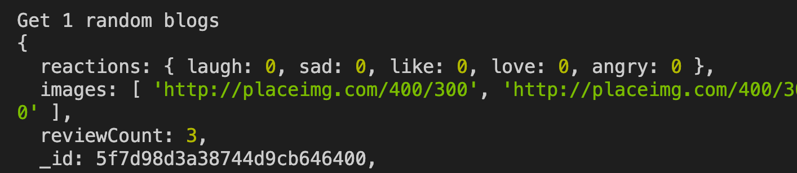
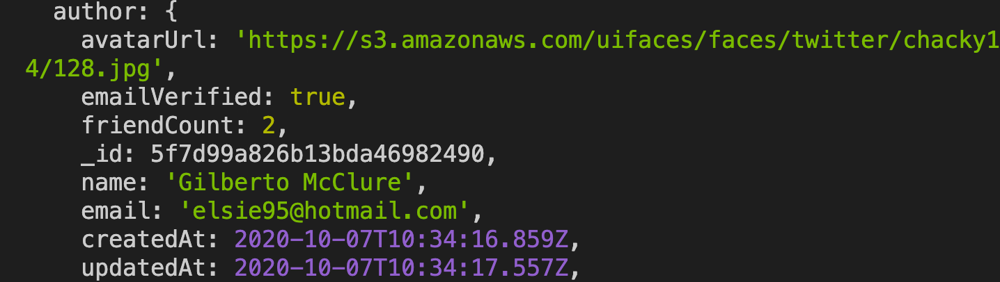
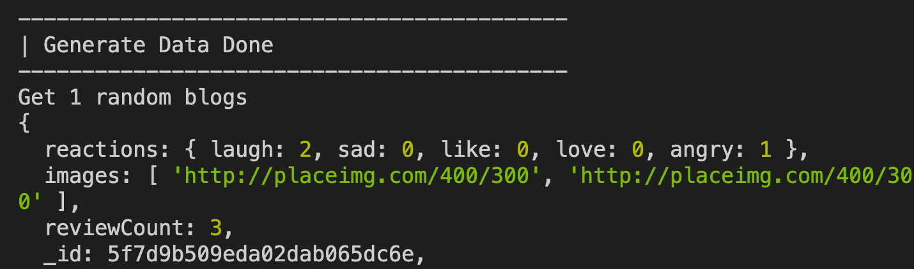

## Adding Mongoose middlewares

In this step, we will add mongoose middlewares into the schemas to automate some common tasks. Example: when you create a new review to a blog, you want to increase the `reviewCount` in the `blogs` collection by 1.

### Update `reviewCount` in Blog

- In `models/Review.js`, add:
```javascript
//...
const Blog = require("./Blog");
//...
reviewSchema.statics.calculateReviews = async function (blogId) {
  const reviewCount = await this.find({ blog: blogId }).countDocuments();
  await Blog.findByIdAndUpdate(blogId, { reviewCount: reviewCount });
};

reviewSchema.post("save", async function () {
  await this.constructor.calculateReviews(this.blog);
});

// Neither findByIdAndUpdate norfindByIdAndDelete have access to document middleware.
// They only get access to query middleware
// Inside this hook, this will point to the current query, not the current review.
// Therefore, to access the review, we’ll need to execute the query
reviewSchema.pre(/^findOneAnd/, async function (next) {
  this.doc = await this.findOne();
  next();
});

reviewSchema.post(/^findOneAnd/, async function (next) {
  await this.doc.constructor.calculateReviews(this.doc.blog);
});

const Review = mongoose.model("Review", reviewSchema);
module.exports = Review;
```

- Run the app with `testSchema`, you should see that `reviewCount` is now updated to 3, because we've created 3 random reviews for each blog:
  

### Update `friendCount` of User

- In `models/Friendship.js`, add:
```javascript
//...
const User = require("./User");
//...
friendshipSchema.statics.calculateFriendCount = async function (userId) {
  const friendCount = await this.find({
    $or: [{ from: userId }, { to: userId }],
    status: "accepted",
  }).countDocuments();
  await User.findByIdAndUpdate(userId, { friendCount: friendCount });
};

friendshipSchema.post("save", function () {
  this.constructor.calculateFriendCount(this.from);
  this.constructor.calculateFriendCount(this.to);
});

friendshipSchema.pre(/^findOneAnd/, async function (next) {
  this.doc = await this.findOne();
  next();
});

friendshipSchema.post(/^findOneAnd/, async function (next) {
  await this.doc.constructor.calculateFriendCount(this.doc.from);
  await this.doc.constructor.calculateFriendCount(this.doc.to);
});

const Friendship = mongoose.model("Friendship", friendshipSchema);
module.exports = Friendship;
```

- Run the app with `testSchema`, you should see that `friendCount` is now updated to 2, because we've added 2 friends to each user:
  

### Update reactions

- In `models/Reaction.js`, add:
  ```javascript
  reactionSchema.statics.calculateReaction = async function (
    targetId,
    targetType
  ) {
    const stats = await this.aggregate([
      {
        $match: { targetId },
      },
      {
        $group: {
          _id: "$targetId",
          laugh: {
            $sum: {
              $cond: [{ $eq: ["$emoji", "laugh"] }, 1, 0],
            },
          },
          sad: {
            $sum: {
              $cond: [{ $eq: ["$emoji", "sad"] }, 1, 0],
            },
          },
          like: {
            $sum: {
              $cond: [{ $eq: ["$emoji", "like"] }, 1, 0],
            },
          },
          love: {
            $sum: {
              $cond: [{ $eq: ["$emoji", "love"] }, 1, 0],
            },
          },
          angry: {
            $sum: {
              $cond: [{ $eq: ["$emoji", "angry"] }, 1, 0],
            },
          },
        },
      },
    ]);
    await mongoose.model(targetType).findByIdAndUpdate(targetId, {
      reactions: {
        laugh: (stats[0] && stats[0].laugh) || 0,
        sad: (stats[0] && stats[0].sad) || 0,
        love: (stats[0] && stats[0].love) || 0,
        like: (stats[0] && stats[0].like) || 0,
        angry: (stats[0] && stats[0].angry) || 0,
      },
    });
  };

  reactionSchema.post("save", async function () {
    // this point to current review
    await this.constructor.calculateReaction(this.targetId, this.targetType);
  });

  reactionSchema.pre(/^findOneAnd/, async function (next) {
    this.doc = await this.findOne();
    next();
  });

  reactionSchema.post(/^findOneAnd/, async function (next) {
    await this.doc.constructor.calculateReaction(
      this.doc.targetId,
      this.doc.targetType
    );
  });

  const Reaction = mongoose.model("Reaction", reactionSchema);
  module.exports = Reaction;
  ```

- Run the app with `testSchema`, you should see that `reactions` is now updated, because we've created 3 random emoji reactions for each blog:
  

### Generate Token for authenticated user

When someone log in, the system will generate a new access token for that user. We will put the function to generate the token in User model as a instance method:

- In `/.env`, add:
  ```
  JWT_SECRET_KEY="any_secret_key"
  ```
  Remember when you change something in `.env` you need to restart your app.

- In `models/User.js`, add:
  ```javascript
  //...
  const jwt = require("jsonwebtoken");
  const JWT_SECRET_KEY = process.env.JWT_SECRET_KEY;
  //...
  userSchema.plugin(require("./plugins/isDeletedFalse"));

  userSchema.methods.toJSON = function () {
    const obj = this._doc;
    delete obj.password;
    delete obj.emailVerified;
    delete obj.emailVerificationCode;
    delete obj.isDeleted;
    return obj;
  };

  userSchema.methods.generateToken = async function () {
    const accessToken = await jwt.sign({ _id: this._id }, JWT_SECRET_KEY, {
      expiresIn: "1d",
    });
    return accessToken;
  };
  ```
  We also add `toJSON()` to remove the fields that we don't want to response to the frontend when we need to provide user info.

Good job! [Back to instructions](/README.md)