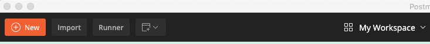
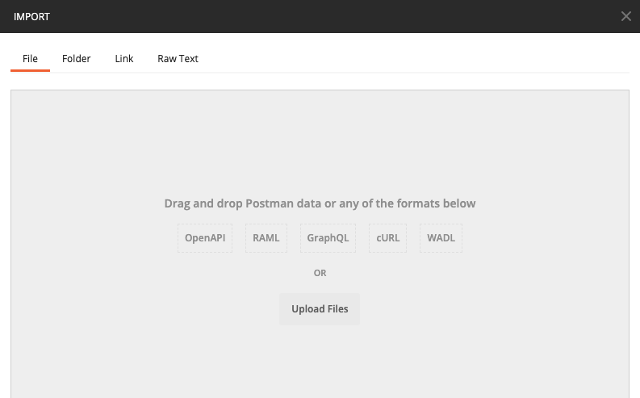
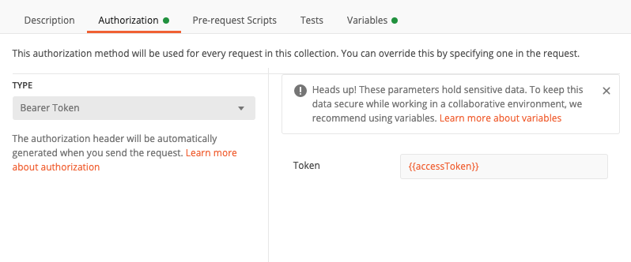
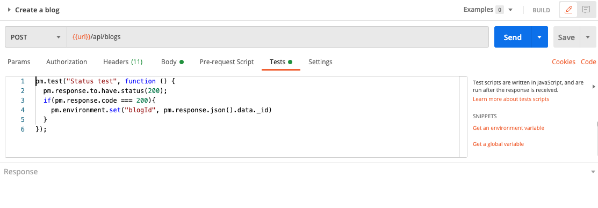
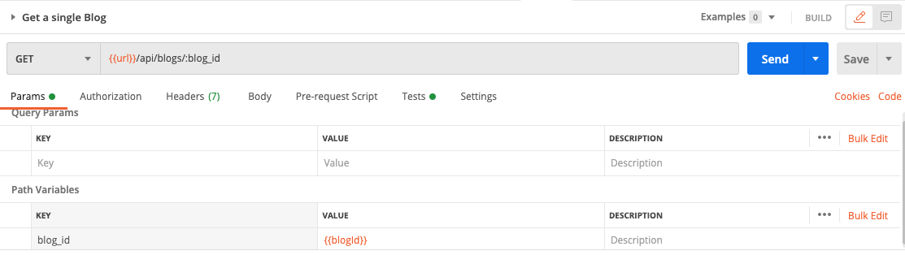

## Create Postman collection

After you have designed the endpoints, you can create a Postman collection for testing even before you write you code.

To support you "a little bit", you can find a JSON file in `/doc/social_blog.postman_collection.json` on this repo. Now open Postman and click the button `Import`:

Then upload the file `social_blog.postman_collection.json`:

There are some few tricks in this collection that you need to know:

- Hover the mouse on the collection on the side menu, click `...` (View more actions), then `Edit`. Click on the tab `Authorization`:
  
  Here is where we define the access token in the header of each request. The value of the token will be store in a variable called `accessToken`.

- Open the collection and click on `POST Login with user A`, open the tab `Tests`:
  
  Here we assign the value of the access token to the variable `accessToken` whenever user log in successfully. We also save the ID of the user as `userIDA`.

- The same trick is apply to get the blog ID after we can create a blog successfully. Open `Blog/Create a blog`, tab `Tests`:
  

- And here is where we use the `blogId`: Open `Blog/Get a single Blog`, tab `Params`:
  
  The key technique here is we define `:blog_id` in the URI and put `{{blogId}}` as the value in `Path Variables`

That's pretty much every thing. Your question is probably why do we need all of that, why don't we just define the value manually.

If you expand all the folders in the collection, you will notice that the requests have an order. Example we create a blog before we get a single blog or delete it. And the final answer for your questions is you can test all of your API at once by running this collection (Hover the mouse on the collection on the side menu, click the "Arrow" icon -> Click `Run` -> Click `Run collection_name`)

You won't pass any test for now. Let's start coding!

Good job! [Back to instructions](/README.md)

