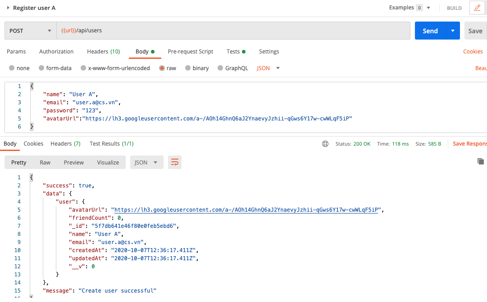
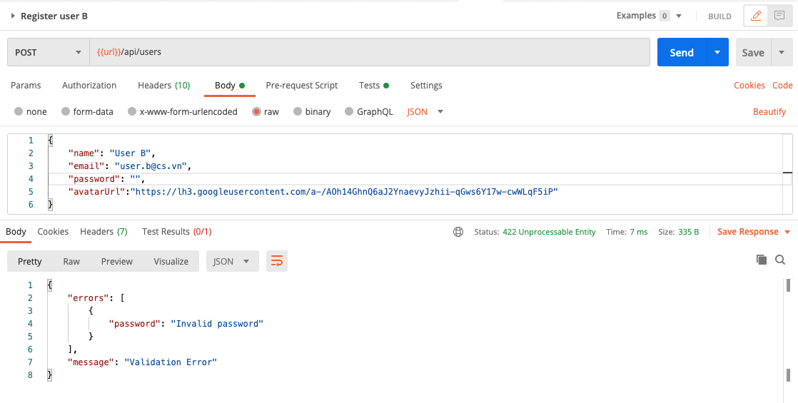

## Register user account and validators

### Register user

- Create `/controllers/user.controller.js`:
  ```javascript
  const {
    AppError,
    catchAsync,
    sendResponse,
  } = require("../helpers/utils.helper");
  const User = require("../models/User");
  const bcrypt = require("bcryptjs");
  const userController = {};

  userController.register = catchAsync(async (req, res, next) => {
    let { name, email, avatarUrl, password } = req.body;
    let user = await User.findOne({ email });
    if (user)
      return next(new AppError(409, "User already exists", "Register Error"));

    const salt = await bcrypt.genSalt(10);
    password = await bcrypt.hash(password, salt);
    user = await User.create({
      name,
      email,
      password,
      avatarUrl,
    });
    const accessToken = await user.generateToken();

    return sendResponse(res, 200, true, { user }, null, "Create user successful");
  });

  module.exports = userController;
  ```

- In `user.api.js`, add:
  ```javascript
  //...
  const userController = require("../controllers/user.controller");

  /**
   * @route POST api/users
   * @description Register new user
   * @access Public
   */
  router.post("/", userController.register);
  ```

- Test with Postman `Authentication/Register user A`, it should work:
  

### Server validation

For safety reason, on the server side we should have data validation. Here we use the library [express-validator](https://express-validator.github.io/docs/). 

It's will be a bit confused but the good news is you can reuse this code in any other projects.

- Create `/middlewares/validators.js`:
```javascript
const utilsHelper = require("../helpers/utils.helper");
const mongoose = require("mongoose");
const { validationResult } = require("express-validator");
const validators = {};

validators.validate = (validationArray) => async (req, res, next) => {
  await Promise.all(validationArray.map((validation) => validation.run(req)));
  const errors = validationResult(req);
  if (errors.isEmpty()) return next();

  const extractedErrors = [];
  errors
    .array()
    .map((error) => extractedErrors.push({ [error.param]: error.msg }));
  return utilsHelper.sendResponse(
    res,
    422,
    false,
    null,
    extractedErrors,
    "Validation Error"
  );
};

validators.checkObjectId = (paramId) => {
  if (!mongoose.Types.ObjectId.isValid(paramId)) {
    throw new Error("Invalid ObjectId");
  }
  return true;
};

module.exports = validators;
```

- In `user.api.js`, add:
```javascript
//...
const validators = require("../middlewares/validators");
const { body } = require("express-validator");
//...
/**
 * @route POST api/users
 * @description Register new user
 * @access Public
 */
router.post(
  "/",
  validators.validate([
    body("name", "Invalid name").exists().notEmpty(),
    body("email", "Invalid email").exists().isEmail(),
    body("password", "Invalid password").exists().notEmpty(),
  ]),
  userController.register
);
```

- Now if you try to register an user without password, name, or email, you will get an error response:
  

Good job! [Back to instructions](/README.md)