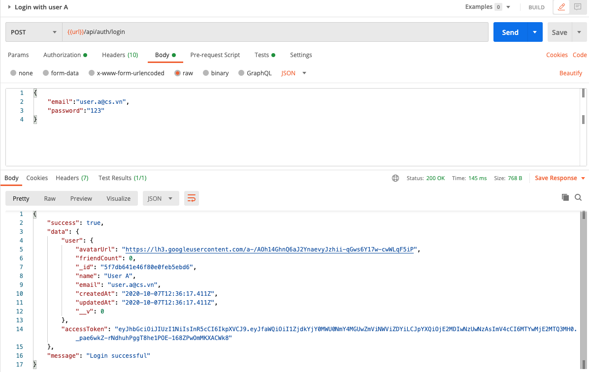

## User can log in

- Create `/controllers/auth.controller.js`:
  ```javascript
  const {
    AppError,
    catchAsync,
    sendResponse,
  } = require("../helpers/utils.helper");
  const User = require("../models/User");
  const bcrypt = require("bcryptjs");
  const authController = {};

  authController.loginWithEmail = catchAsync(async (req, res, next) => {
    const { email, password } = req.body;
    const user = await User.findOne({ email }, "+password");
    if (!user)
      return next(new AppError(400, "Invalid credentials", "Login Error"));

    const isMatch = await bcrypt.compare(password, user.password);
    if (!isMatch) return next(new AppError(400, "Wrong password", "Login Error"));

    accessToken = await user.generateToken();
    return sendResponse(
      res,
      200,
      true,
      { user, accessToken },
      null,
      "Login successful"
    );
  });

  module.exports = authController;
  ```

- In `routes/auth.api.js`, add:
```javascript
//...
const validators = require("../middlewares/validators");
const { body } = require("express-validator");
const authController = require("../controllers/auth.controller");

/**
 * @route POST api/auth/login
 * @description Login
 * @access Public
 */
router.post(
  "/login",
  validators.validate([
    body("email", "Invalid email").exists().isEmail(),
    body("password", "Invalid password").exists().notEmpty(),
  ]),
  authController.loginWithEmail
);
```

- Test with Postman:
  


### Authentication middleware

Now we have provided an access token for every user after logging in. Next, we need to build a middleware to validate the access token in the header of the request sent by the frontend.

- Create `middlewares/authentication.js`:
```javascript
const jwt = require("jsonwebtoken");
const JWT_SECRET_KEY = process.env.JWT_SECRET_KEY;
const { AppError } = require("../helpers/utils.helper");
const authMiddleware = {};

authMiddleware.loginRequired = (req, res, next) => {
  try {
    const tokenString = req.headers.authorization;
    if (!tokenString)
      return next(new AppError(401, "Login required", "Validation Error"));
    const token = tokenString.replace("Bearer ", "");
    jwt.verify(token, JWT_SECRET_KEY, (err, payload) => {
      if (err) {
        if (err.name === "TokenExpiredError") {
          return next(new AppError(401, "Token expired", "Validation Error"));
        } else {
          return next(
            new AppError(401, "Token is invalid", "Validation Error")
          );
        }
      }
      // console.log(payload);
      req.userId = payload._id;
    });
    next();
  } catch (error) {
    next(error);
  }
};

module.exports = authMiddleware;
```

Good job! [Back to instructions](/README.md)