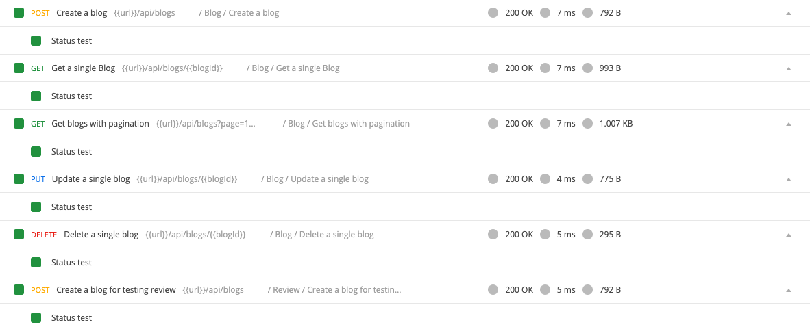

## Blog APIs

In this step we will implement CRUD process for blogs.

- Create `/controllers/blog.controller.js`:
```javascript
const {
  AppError,
  catchAsync,
  sendResponse,
} = require("../helpers/utils.helper");
const Blog = require("../models/Blog");
const Review = require("../models/Review");
const User = require("../models/User");
const blogController = {};

blogController.getBlogs = catchAsync(async (req, res, next) => {
  let { page, limit, sortBy, ...filter } = { ...req.query };
  page = parseInt(page) || 1;
  limit = parseInt(limit) || 10;

  const totalBlogs = await Blog.countDocuments({
    ...filter,
    isDeleted: false,
  });
  const totalPages = Math.ceil(totalBlogs / limit);
  const offset = limit * (page - 1);

  // console.log({ filter, sortBy });
  const blogs = await Blog.find(filter)
    .sort({ ...sortBy, createdAt: -1 })
    .skip(offset)
    .limit(limit)
    .populate("author");

  return sendResponse(res, 200, true, { blogs, totalPages }, null, "");
});

blogController.getSingleBlog = catchAsync(async (req, res, next) => {
  let blog = await Blog.findById(req.params.id).populate("author");
  if (!blog)
    return next(new AppError(404, "Blog not found", "Get Single Blog Error"));
  blog = blog.toJSON();
  blog.reviews = await Review.find({ blog: blog._id }).populate("user");
  return sendResponse(res, 200, true, blog, null, null);
});

blogController.createNewBlog = catchAsync(async (req, res, next) => {
  const author = req.userId;
  const { title, content } = req.body;
  let { images } = req.body;

  const blog = await Blog.create({
    title,
    content,
    author,
    images,
  });

  return sendResponse(res, 200, true, blog, null, "Create new blog successful");
});

blogController.updateSingleBlog = catchAsync(async (req, res, next) => {
  const author = req.userId;
  const blogId = req.params.id;
  const { title, content } = req.body;

  const blog = await Blog.findOneAndUpdate(
    { _id: blogId, author: author },
    { title, content },
    { new: true }
  );
  if (!blog)
    return next(
      new AppError(
        400,
        "Blog not found or User not authorized",
        "Update Blog Error"
      )
    );
  return sendResponse(res, 200, true, blog, null, "Update Blog successful");
});

blogController.deleteSingleBlog = catchAsync(async (req, res, next) => {
  const author = req.userId;
  const blogId = req.params.id;

  const blog = await Blog.findOneAndUpdate(
    { _id: blogId, author: author },
    { isDeleted: true },
    { new: true }
  );
  if (!blog)
    return next(
      new AppError(
        400,
        "Blog not found or User not authorized",
        "Delete Blog Error"
      )
    );
  return sendResponse(res, 200, true, null, null, "Delete Blog successful");
});

module.exports = blogController;
```

- In `routes/blog.api.js`:
```javascript
const express = require("express");
const router = express.Router();
const blogController = require("../controllers/blog.controller");
const validators = require("../middlewares/validators");
const authMiddleware = require("../middlewares/authentication");
const { body, param } = require("express-validator");

/**
 * @route GET api/blogs?page=1&limit=10
 * @description Get blogs with pagination
 * @access Public
 */
router.get("/", blogController.getBlogs);

/**
 * @route GET api/blogs/:id
 * @description Get a single blog
 * @access Public
 */
router.get(
  "/:id",
  validators.validate([
    param("id").exists().isString().custom(validators.checkObjectId),
  ]),
  blogController.getSingleBlog
);

/**
 * @route POST api/blogs
 * @description Create a new blog
 * @access Login required
 */
router.post(
  "/",
  authMiddleware.loginRequired,
  // uploader.array("images", 2),
  validators.validate([
    body("title", "Missing title").exists().notEmpty(),
    body("content", "Missing content").exists().notEmpty(),
  ]),
  blogController.createNewBlog
);

/**
 * @route PUT api/blogs/:id
 * @description Update a blog
 * @access Login required
 */
router.put(
  "/:id",
  authMiddleware.loginRequired,
  validators.validate([
    param("id").exists().isString().custom(validators.checkObjectId),
    body("title", "Missing title").exists().notEmpty(),
    body("content", "Missing content").exists().notEmpty(),
  ]),
  blogController.updateSingleBlog
);

/**
 * @route DELETE api/blogs/:id
 * @description Delete a blog
 * @access Login required
 */
router.delete(
  "/:id",
  authMiddleware.loginRequired,
  validators.validate([
    param("id").exists().isString().custom(validators.checkObjectId),
  ]),
  blogController.deleteSingleBlog
);

module.exports = router;
```

- Test with Postman, you should pass all the request in folder `Blog`.
  

Good job! [Back to instructions](/README.md)