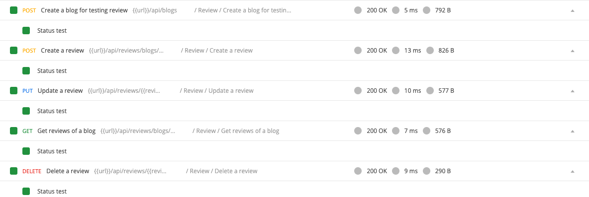

## Review APIs

In this step we will implement CRUD process for reviews. Another goal is to figure out the pattern in the code (similarity between CRUD for blogs and reviews)

- Create `/controllers/review.controller.js`:
  ```javascript
  const {
    AppError,
    catchAsync,
    sendResponse,
  } = require("../helpers/utils.helper");
  const Review = require("../models/Review");
  const Blog = require("../models/Blog");

  const reviewController = {};

  reviewController.createNewReview = catchAsync(async (req, res, next) => {
    const userId = req.userId;
    const blogId = req.params.id;
    const { content } = req.body;

    const blog = Blog.findById(blogId);
    if (!blog)
      return next(new AppError(404, "Blog not found", "Create New Review Error"));

    let review = await Review.create({
      user: userId,
      blog: blogId,
      content,
    });
    review = await review.populate("user").execPopulate();
    return sendResponse(
      res,
      200,
      true,
      review,
      null,
      "Create new review successful"
    );
  });

  reviewController.getReviewsOfBlog = catchAsync(async (req, res, next) => {
    const blogId = req.params.id;
    const page = parseInt(req.query.page) || 1;
    const limit = parseInt(req.query.limit) || 10;

    const blog = Blog.findById(blogId);
    if (!blog)
      return next(new AppError(404, "Blog not found", "Create New Review Error"));

    const totalReviews = await Review.countDocuments({ blog: blogId });
    const totalPages = Math.ceil(totalReviews / limit);
    const offset = limit * (page - 1);

    const reviews = await Review.find({ blog: blogId })
      .sort({ createdAt: -1 })
      .skip(offset)
      .limit(limit);

    return sendResponse(res, 200, true, { reviews, totalPages }, null, "");
  });

  reviewController.updateSingleReview = catchAsync(async (req, res, next) => {
    const userId = req.userId;
    const reviewId = req.params.id;
    const { content } = req.body;

    const review = await Review.findOneAndUpdate(
      { _id: reviewId, user: userId },
      { content },
      { new: true }
    );
    if (!review)
      return next(
        new AppError(
          400,
          "Review not found or User not authorized",
          "Update Review Error"
        )
      );
    return sendResponse(res, 200, true, review, null, "Update successful");
  });

  reviewController.deleteSingleReview = catchAsync(async (req, res, next) => {
    const userId = req.userId;
    const reviewId = req.params.id;

    const review = await Review.findOneAndDelete({
      _id: reviewId,
      user: userId,
    });
    if (!review)
      return next(
        new AppError(
          400,
          "Review not found or User not authorized",
          "Delete Review Error"
        )
      );
    return sendResponse(res, 200, true, null, null, "Delete successful");
  });

  module.exports = reviewController;
  ```

- In `routes/blog.api.js`:
```javascript
const express = require("express");
const router = express.Router();
const reviewController = require("../controllers/review.controller");
const validators = require("../middlewares/validators");
const authMiddleware = require("../middlewares/authentication");
const { body, param } = require("express-validator");

/**
 * @route GET api/reviews/blogs/:id?page=1&limit=10
 * @description Get reviews of a blog with pagination
 * @access Public
 */
router.get(
  "/blogs/:id",
  validators.validate([
    param("id").exists().isString().custom(validators.checkObjectId),
  ]),
  reviewController.getReviewsOfBlog
);

/**
 * @route POST api/reviews/blogs/:id
 * @description Create a new review for a blog
 * @access Login required
 */
router.post(
  "/blogs/:id",
  authMiddleware.loginRequired,
  validators.validate([
    param("id").exists().isString().custom(validators.checkObjectId),
    body("content", "Missing content").exists().notEmpty(),
  ]),
  reviewController.createNewReview
);

/**
 * @route PUT api/reviews/:id
 * @description Update a review
 * @access Login required
 */
router.put(
  "/:id",
  authMiddleware.loginRequired,
  validators.validate([
    param("id").exists().isString().custom(validators.checkObjectId),
    body("content", "Missing content").exists().notEmpty(),
  ]),
  reviewController.updateSingleReview
);

/**
 * @route DELETE api/reviews/:id
 * @description Delete a review
 * @access Login required
 */
router.delete(
  "/:id",
  authMiddleware.loginRequired,
  validators.validate([
    param("id").exists().isString().custom(validators.checkObjectId),
  ]),
  reviewController.deleteSingleReview
);

module.exports = router;
```

- Test with Postman, you should pass all the request in folder `Review`.
  

Good job! [Back to instructions](/README.md)