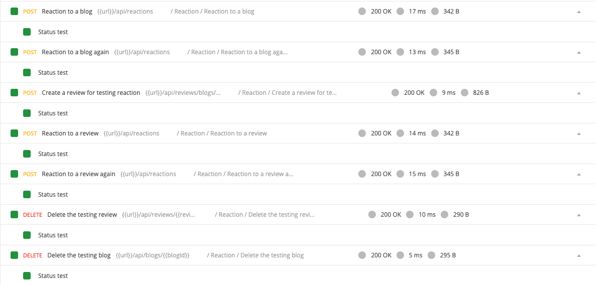

## Reaction API

We only need one API for the emoji reaction. That's something special. The reason is because when the server receive a request for an emoji reaction, the server will create a new one or remove/update the old one. Example sending "love" twice means nothing happens.

- Create `controllers/reaction.controller.js`:
```javascript
const {
  AppError,
  catchAsync,
  sendResponse,
} = require("../helpers/utils.helper");
const Reaction = require("../models/Reaction");
const mongoose = require("mongoose");
const reactionController = {};

reactionController.saveReaction = catchAsync(async (req, res, next) => {
  const { targetType, targetId, emoji } = req.body;

  const targetObj = await mongoose.model(targetType).findById(targetId);
  if (!targetObj)
    return next(
      new AppError(404, `${targetType} not found`, "Create Reaction Error")
    );

  // Find the reaction of the current user
  let reaction = await Reaction.findOne({
    targetType,
    targetId,
    user: req.userId,
  });
  let message = "";
  if (!reaction) {
    await Reaction.create({ targetType, targetId, user: req.userId, emoji });
    message = "Added reaction";
  } else {
    if (reaction.emoji === emoji) {
      await Reaction.findOneAndDelete({ _id: reaction._id });
      message = "Removed reaction";
    } else {
      await Reaction.findOneAndUpdate({ _id: reaction._id }, { emoji });
      message = "Updated reaction";
    }
  }
  // Get the updated number of reactions in the targetType
  const reactionStat = await mongoose
    .model(targetType)
    .findById(targetId, "reactions");
  return sendResponse(res, 200, true, reactionStat.reactions, null, message);
});

module.exports = reactionController;
```

- In `/routes/reaction.api.js`:
```javascript
const express = require("express");
const router = express.Router();
const authMiddleware = require("../middlewares/authentication");
const validators = require("../middlewares/validators");
const { body } = require("express-validator");
const reactionController = require("../controllers/reaction.controller");

/**
 * @route POST api/reactions
 * @description Save a reaction to blog or review
 * @access Login required
 */
router.post(
  "/",
  authMiddleware.loginRequired,
  validators.validate([
    body("targetType", "Invalid targetType").exists().isIn(["Blog", "Review"]),
    body("targetId", "Invalid targetId")
      .exists()
      .custom(validators.checkObjectId),
    body("emoji", "Invalid emoji")
      .exists()
      .isIn(["laugh", "sad", "like", "love", "angry"]),
  ]),
  reactionController.saveReaction
);

module.exports = router;
```

- Test with Postman, you should pass all the request in folder `Reaction`.
  

Good job! [Back to instructions](/README.md)