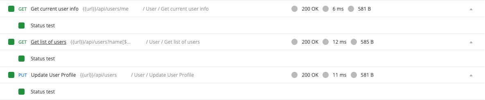

## User APIs

In this step, we will implement these APIs:
- Get current user info
- Update user profile
- Get list of users with pagination

- In `user.controller.js`, add:
```javascript
//...
const Friendship = require("../models/Friendship");
//...
userController.updateProfile = catchAsync(async (req, res, next) => {
  const userId = req.userId;
  const allows = ["name", "password", "avatarUrl"];
  const user = await User.findById(userId);
  if (!user) {
    return next(new AppError(404, "Account not found", "Update Profile Error"));
  }

  allows.forEach((field) => {
    if (req.body[field] !== undefined) {
      user[field] = req.body[field];
    }
  });
  await user.save();
  return sendResponse(
    res,
    200,
    true,
    user,
    null,
    "Update Profile successfully"
  );
});

userController.getUsers = catchAsync(async (req, res, next) => {
  let { page, limit, sortBy, ...filter } = { ...req.query };
  const currentUserId = req.userId;
  page = parseInt(page) || 1;
  limit = parseInt(limit) || 10;

  const totalUsers = await User.countDocuments({
    ...filter,
    isDeleted: false,
  });
  const totalPages = Math.ceil(totalUsers / limit);
  const offset = limit * (page - 1);

  let users = await User.find(filter)
    .sort({ ...sortBy, createdAt: -1 })
    .skip(offset)
    .limit(limit);

  const promises = users.map(async (user) => {
    let temp = user.toJSON();
    temp.friendship = await Friendship.findOne(
      {
        $or: [
          { from: currentUserId, to: user._id },
          { from: user._id, to: currentUserId },
        ],
      },
      "-_id status updatedAt"
    );
    return temp;
  });
  const usersWithFriendship = await Promise.all(promises);

  return sendResponse(
    res,
    200,
    true,
    { users: usersWithFriendship, totalPages },
    null,
    ""
  );
});

userController.getCurrentUser = catchAsync(async (req, res, next) => {
  const userId = req.userId;
  const user = await User.findById(userId);
  if (!user)
    return next(new AppError(400, "User not found", "Get Current User Error"));
  return sendResponse(
    res,
    200,
    true,
    user,
    null,
    "Get current user successful"
  );
});
```

- In `user.api.js`, add:
```javascript
//...
const authMiddleware = require("../middlewares/authentication");
//...

/**
 * @route PUT api/users/
 * @description Update user profile
 * @access Login required
 */
router.put("/", authMiddleware.loginRequired, userController.updateProfile);

/**
 * @route GET api/users/me
 * @description Get current user info
 * @access Login required
 */
router.get("/me", authMiddleware.loginRequired, userController.getCurrentUser);

/**
 * @route GET api/users?page=1&limit=10
 * @description Get users with pagination
 * @access Login required
 */
router.get("/", authMiddleware.loginRequired, userController.getUsers);

module.exports = router;
```

- Test with Postman, you should pass all the request in folder `User`.
  

Good job! [Back to instructions](/README.md)